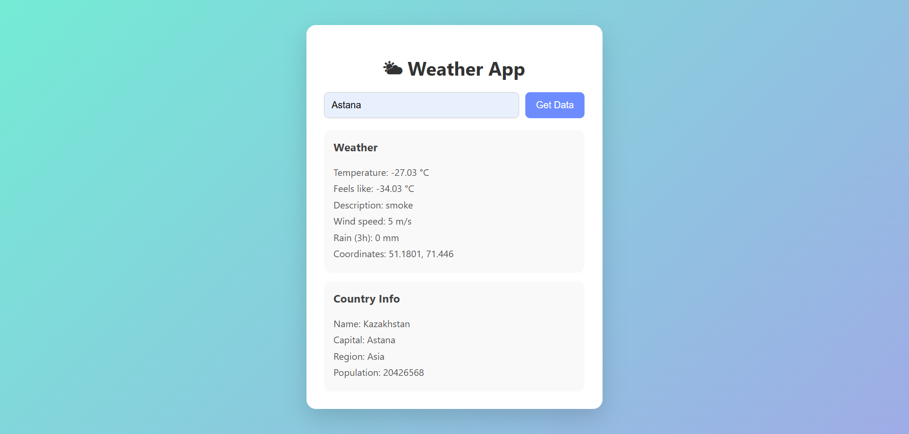
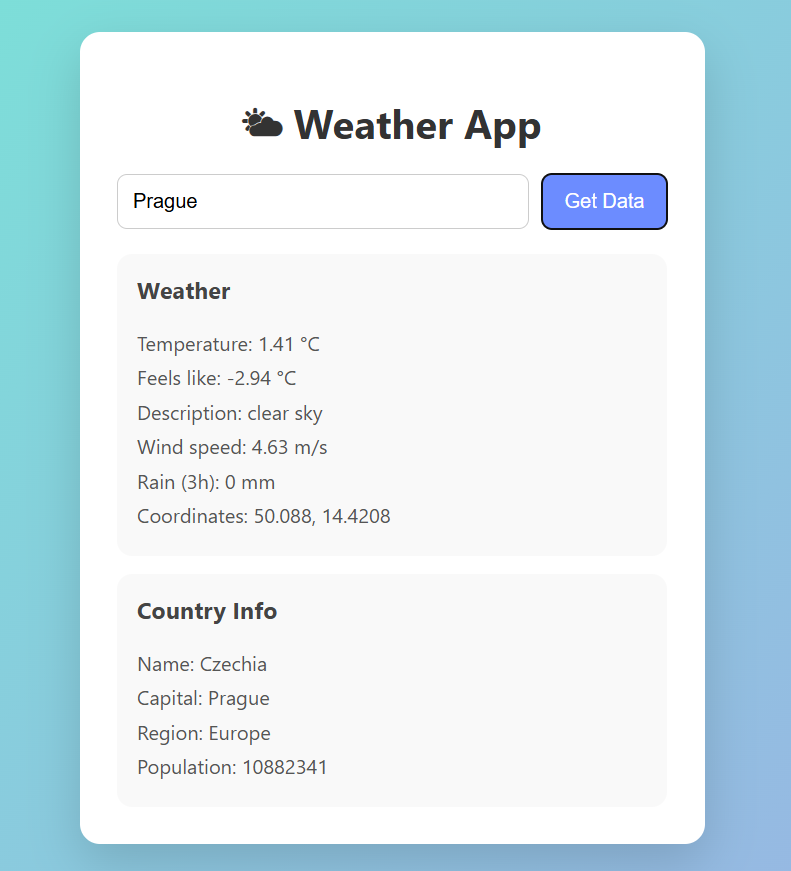
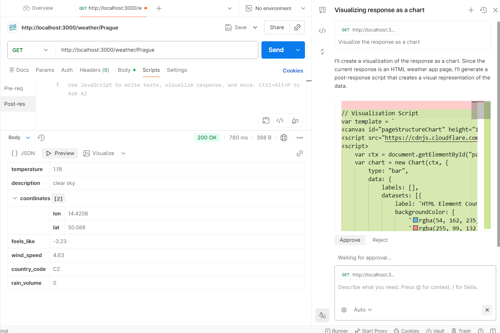

https://ablk3k.github.io/web2-assignment2/

**Project**: Simple Weather App (backend + static frontend)

- **Files**: [index.html](index.html), [script.js](script.js), [server.js](server.js), [style.css](style.css), [.env](.env)

**Setup Instructions**
- **Install dependencies:** Run `npm install` in the project root.
- **Add API key:** Create a `.env` file (already present) with `OPENWEATHER_API_KEY=your_key` and optional `PORT`.
- **Start server:** `npm start` (starts the Express server and serves the frontend).
- **Open app:** Visit `http://localhost:3000` in your browser (do not open the file directly with the file:// protocol).

**Environment**
- The app reads `OPENWEATHER_API_KEY` from `.env` using `dotenv`.
- The server listens on port `3000` (or set `PORT` in `.env` and modify `server.js` if desired).

**API Usage**
- `GET /weather/:city` — returns current weather for `:city` (proxied through the server to OpenWeather).
	- Example request (curl):

```
curl http://localhost:3000/weather/Astana
```

	- Sample JSON response:

```
{
	"temperature": -27.03,
	"feels_like": -34.03,
	"description": "smoke",
	"wind_speed": 5 m/s,
	"rain(3h)": 0 mm,
	"coordinates": {"lat": 51.1801, "lon": 71.446},
}
```

- `GET /country/:code` — returns basic country info for ISO alpha code `:code` (uses restcountries API).
	- Example:

```
curl http://localhost:3000/country/GB
```

	- Sample JSON response:

```
{
	"name": "Kazakhstan",
	"capital": "Astana",
	"region": "Asia",
	"population": 20426568
}
```





**Key Design Decisions**
- One server, fewer headaches: The Express app serves the static site and forwards API calls. That keeps the API key on the server and avoids CORS complexity for the frontend.
- Small, focused responses: The backend only returns the fields the UI needs (temp, coords, description, etc.), which keeps the frontend code tidy and less error-prone.
- Simple, readable server code: We use `axios` with `async/await` so the proxy calls are easy to follow and maintain.
- Keep secrets out of source: `dotenv` is used for the OpenWeather key — don’t commit `.env` to version control.
- Minimal demo-grade errors: For now the server returns basic 500 responses on upstream failures. For a production app, add structured logging and more informative client errors.

**Troubleshooting**
- If the frontend cannot fetch `/weather/:city`:
	- Ensure `npm start` is running and server console logs `Server running at http://localhost:3000`.
	- Verify `.env` contains a valid `OPENWEATHER_API_KEY`.
	- Open browser DevTools → Network/Console to inspect the failing request and response code.
- If OpenWeather returns 401/403, the API key is invalid or rate-limited.

**Files**
- Frontend entry: [index.html](index.html)
- Frontend logic: [script.js](script.js)

- Server & API proxy: [server.js](server.js)
